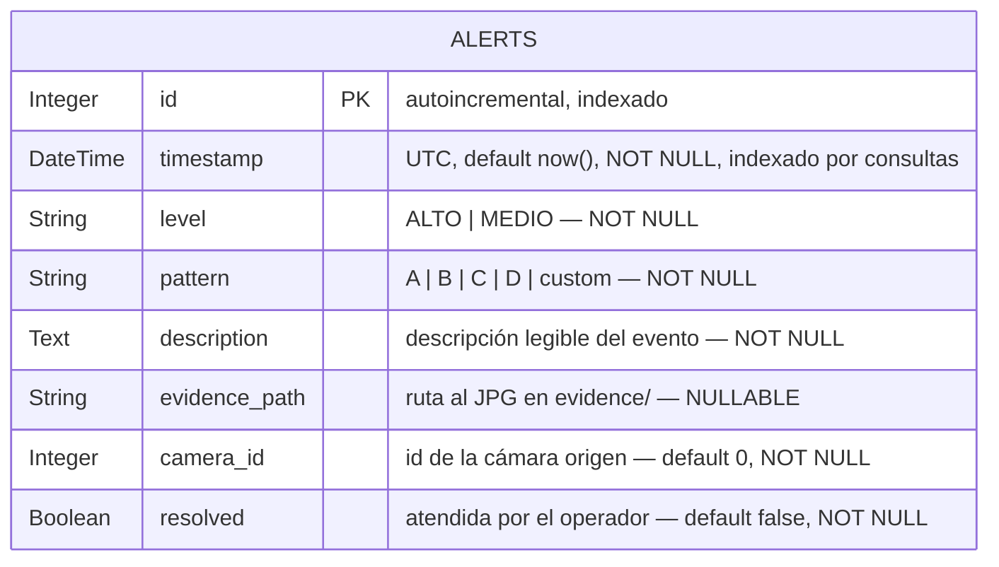

## Índice

1. [Descripción general del producto](1-descripcion-general-del-producto.md)
2. [Arquitectura del sistema](2-arquitectura-del-sistema.md)
3. [Modelo de datos](3-modelo-de-datos.md)
4. [Especificación de la API](4-especificaciones-de-la-api.md)
5. [Historias de usuario](5-historias-de-usuario.md)
6. [Tickets de trabajo](6-tickets-de-trabajo.md)
7. [Pull requests](7-pull-requests.md)

---

## 3. Modelo de Datos

El modelo es deliberadamente **minimalista**: una sola entidad de persistencia, `alerts`,
que registra cada detección. La configuración (cámaras, umbrales, tiendas) NO se persiste en
BD: vive en `app/config.py`, `app/rules.yaml` y `stores.yaml`. La evidencia fotográfica se
guarda como **archivo** en `evidence/` y la fila solo almacena su ruta. El motor es SQLite
(piloto) o PostgreSQL (producción) sobre el mismo ORM SQLAlchemy.

### Diagrama entidad-relación



### Tabla `alerts`

| Campo | Tipo | Restricciones | Descripción |
|-------|------|---------------|-------------|
| `id` | Integer | PK, autoincrement, index | Identificador único de la alerta |
| `timestamp` | DateTime | NOT NULL, default `utcnow` | Momento de la detección (UTC) |
| `level` | String(10) | NOT NULL | Nivel de riesgo: `ALTO` o `MEDIO` |
| `pattern` | String(50) | NOT NULL | Patrón que disparó la alerta: `A`/`B`/`C`/`D`/`custom` |
| `description` | Text | NOT NULL | Texto legible del comportamiento detectado |
| `evidence_path` | String(500) | NULLABLE | Ruta al JPG del frame sospechoso en `evidence/` |
| `camera_id` | Integer | NOT NULL, default 0 | Cámara que originó la alerta |
| `resolved` | Boolean | NOT NULL, default `false` | Si el operador ya la atendió |

### Decisiones de modelado

- **Una sola tabla.** El piloto solo necesita registrar y consultar alertas; no hay
  usuarios, roles ni inventario en BD. Esto mantiene el arranque sin migraciones complejas.
- **Evidencia en disco, no en BD.** Los JPG se guardan en `evidence/` y la fila referencia
  la ruta; al servir la evidencia hay un *fallback por basename* para tolerar rutas
  absolutas de una máquina anterior tras una migración.
- **`timestamp` en UTC.** Para que las estadísticas por hora (`extract('hour', ...)`)
  funcionen igual en SQLite y PostgreSQL.
- **`store_id` no está en la tabla.** En la arquitectura multi-tienda, el gateway enriquece
  el `store_id` en el *payload* (REST y WebSocket) sin tocar el esquema. La columna se
  añadiría solo al consolidar una BD central (ver hoja de ruta, Fase C).
- **Persistencia selectiva.** Por defecto solo se persisten las alertas `ALTO`
  (`alerts.save_medium_to_db: false` en `rules.yaml`); las `MEDIO` pueden emitirse por
  WebSocket sin guardarse, para no inflar la BD con eventos de bajo valor.

---

**Prompt 1: Diseño del esquema de alertas**
*Contexto: Definir la entidad mínima que registre cada detección.*
```
# ROL
Actúa como data engineer especializado en modelado relacional con SQLAlchemy 2.0 y en
portabilidad entre motores SQL.

# CONTEXTO
ShopGuard necesita registrar cada detección sospechosa (alerta). NO hay usuarios, roles ni
inventario en BD: solo eventos. La evidencia es una imagen JPG que se guarda en disco
(evidence/), no como blob en la base de datos.

# OBJETIVO
Diseñar el modelo de datos de persistencia (la entidad alerta).

# REQUISITOS DEL ESQUEMA
Campos: nivel de riesgo (ALTO/MEDIO), patrón que la disparó (A/B/C/D/custom), descripción
legible, cámara de origen, ruta de la imagen de evidencia (nullable), timestamp y flag de
resuelta.

# RESTRICCIONES
- SQLAlchemy 2.0 (DeclarativeBase). Una sola clase ORM, mínima.
- El MISMO modelo debe funcionar en SQLite (piloto) y PostgreSQL (producción) cambiando solo
  DATABASE_URL.
- timestamp en UTC, con default e indexado para consultas por fecha.
- Tipos, longitudes, nullability y defaults explícitos.

# ENTREGABLE
La clase ORM Alert con sus columnas/constraints y la función init_db() para crear el esquema.
Justifica brevemente por qué una sola tabla es suficiente para el MVP.
```
**Respuesta clave del asistente:**
> "Una entidad `Alert` (tabla `alerts`) con `id` PK, `timestamp` UTC default, `level`,
> `pattern`, `description`, `evidence_path` nullable, `camera_id` default 0 y `resolved`
> default false. `DeclarativeBase` de SQLAlchemy 2.0; el mismo modelo sirve para SQLite y
> Postgres cambiando solo `DATABASE_URL`."

**Impacto en el proyecto:**
Definió `app/database.py` (clase `Alert`, `init_db`, `save_alert`).

**Prompt 2: Consultas, filtros y estadísticas**
*Contexto: El dashboard necesita listar, filtrar y agregar alertas.*
```
# ROL
Eres ingeniero backend especializado en capas de acceso a datos (DAL) y consultas SQL
portables.

# CONTEXTO
El dashboard local y el gateway necesitan consultar y agregar las alertas de la tabla alerts.
La misma capa debe funcionar en SQLite y PostgreSQL sin SQL específico de motor.

# OBJETIVO
Implementar las funciones de consulta y agregación sobre la tabla alerts.

# REQUISITOS
- Listar con paginación (limit/offset) y filtros: level, resolved, rango de fechas.
- Obtener una alerta por id.
- Marcar resuelta: individual y en bulk (por lista de ids O por filtros level+fechas).
- Estadísticas: total de hoy, total por nivel, total sin resolver, y conteo por hora del día.

# RESTRICCIÓN DE PORTABILIDAD
El conteo por hora debe usar una expresión que funcione igual en SQLite y PostgreSQL
(p. ej. extract('hour', ...)); evita funciones propietarias de un solo motor.

# ENTREGABLE
Las funciones get_alerts, get_alert, mark_resolved, bulk_mark_resolved y get_stats, con
manejo de sesión y cierre seguro.
```
**Respuesta clave del asistente:**
> "Funciones `get_alerts` (filtros + offset/limit), `get_alert`, `mark_resolved`,
> `bulk_mark_resolved` (por ids o por level+fechas) y `get_stats`. Para el conteo por hora
> uso `extract('hour', Alert.timestamp)`, compatible con ambos motores."

**Impacto en el proyecto:**
Generó `get_alerts`, `bulk_mark_resolved` y `get_stats` en `app/database.py`.

**Prompt 3: store_id sin migración de esquema**
*Contexto: Identificar la tienda de origen en el gateway sin alterar la tabla.*
```
# ROL
Actúa como arquitecto de datos que decide cuándo evolucionar un esquema y cuándo evitarlo
(YAGNI vs. deuda técnica).

# CONTEXTO
En la versión multi-tienda, cada tienda tiene su PROPIA base de datos con su tabla alerts.
El gateway agrega varias tiendas. Quiero poder saber de qué tienda viene cada alerta, pero
añadir una columna store_id a la tabla de cada tienda obligaría a migrar N bases de datos
para un dato que, dentro de la tienda, es constante.

# OBJETIVO
Decidir dónde y cómo se materializa la identidad de la tienda (store_id) en cada alerta.

# PREGUNTAS A RESOLVER
- ¿Puede el gateway etiquetar las alertas con su store_id en tiempo de agregación, sin tocar
  el esquema de las tiendas? ¿En REST y en WebSocket?
- ¿Qué trade-offs tiene enriquecer en el payload vs. persistir la columna?
- ¿Bajo qué condición futura SÍ valdría la pena migrar el esquema y añadir store_id como
  columna (y exponer un filtro por tienda en /alerts)?

# ENTREGABLE
Recomendación argumentada con su disparador de decisión (cuándo cambiar de estrategia).
```
**Respuesta clave del asistente:**
> "El gateway enriquece `store_id` en el payload REST y WebSocket en tiempo de agregación,
> sin tocar la tabla. Solo merecería migrar el esquema (añadir columna `store_id` + filtro
> en `/alerts`) si se consolida una BD central única para toda la cadena."

**Impacto en el proyecto:**
Justificó la decisión de enriquecer `store_id` en el gateway en lugar de migrar el esquema.
